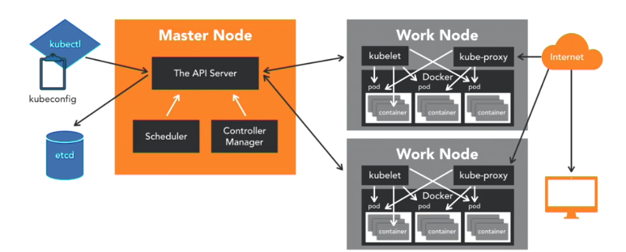

# Kubernetes
A quick intro to Kubernetes.  
https://kubernetes.io/

## Kubernetes Architecture

- The master node is responsible for the overall management of the Kubernetes
  cluster. It uses `etcd` as its database to store all cluster data.
- `kubectl` provides a cli interface to the master node.
- Work nodes are the nodes where the application operates. Every work node runs two processes:
    * `kubelet` communicates with the master node to see if pods have been assigned to nodes, executes pod containers through the container engine, and monitors pod/node status.
    * `kube-proxy` provides network services and load balancing.

## Kubernetes Building Blocks

### Node
A node serves as a worker machine in a K8s cluster. The node can be a physical computer or a virtual machine.

Commands:
```sh
# list available nodes
kubectl get nodes
```

### Pod
Represents one running process on your cluster. It is the simplest unit you can interact with.

A pod contains:
- Your docker application container(s)
- Storage resources
- A unique network IP

Commands:
```sh
# list available pods
kubectl get pods

# get pod logs
kubectl logs <pod_name>

# exec into a pod
kubectl exec -it <pod_name> <command>

# delete a pod
kubectl delete pod/<name>
```

Example Pod configuration:
```yaml
apiVersion: v1
kind: Pod
metadata:
  name: helloworld
  labels:
    env: production
    author: karthequian
    application_type: ui
    release-version: "1.0"
spec:
  containers:
  - name: helloworld
    image: karthequian/helloworld:latest
```

### Controllers

#### ReplicaSet
Ensures that a specified number of replicas for a pod are running at all times.

Commands:
```sh
# list replica sets
kubectl get rs

# scale a replica set
kubectl scale --replicas=<N> deploy/<deployment_name>
```

#### Deployment
Provides declarative updates for pods and ReplicaSets.

Commands:
```sh
# list deployments
kubectl get deployments

# show deployment configuration
kubectl get deployment/<deployment_name> -o yaml

# show deployment status
kubectl describe deployment <deployment_name>
```

#### DaemonSets
Ensure that all nodes run a copy of a specific pod.

Commands:
```sh
# list all daemonsets
kubectl get daemonsets
```

Example DaemonSet Configuration:
```yaml
apiVersion: apps/v1beta2
kind: DaemonSet
metadata:
  name: example-daemonset
  namespace: default
  labels:
    k8s-app: example-daemonset
spec:
  selector:
    matchLabels:
      name: example-daemonset
  template:
    metadata:
      labels:
        name: example-daemonset
    spec:
      #nodeSelector: minikube # Specify if you want to run on specific nodes
      containers:
      - name: example-daemonset
        image: busybox
        args:
        - /bin/sh
        - -c
        - date; sleep 1000
        resources:
          limits:
            memory: 200Mi
          requests:
            cpu: 100m
            memory: 200Mi
      terminationGracePeriodSeconds: 30
```

#### Jobs
Supervisor process for pods carrying out batch jobs. These pods usually run individual processes that run once and complete successfully.

Commands:
```
kubectl get cronjobs
```

Example cron job configuration:
```yaml
apiVersion: batch/v1beta1
kind: CronJob
metadata:
  name: hellocron
spec:
  schedule: "*/1 * * * *" #Runs every minute (cron syntax) or @hourly.
  jobTemplate:
    spec:
      template:
        spec:
          containers:
          - name: hellocron
            image: busybox
            args:
            - /bin/sh
            - -c
            - date; echo Hello from your Kubernetes cluster
          restartPolicy: OnFailure #could also be Always or Never
  suspend: false #Set to true if you want to suspend in the future
```

#### Services
Allow the communication between one set of deployments with another.

Commands:
```sh
# list available services
kubectl get services

# expose deployment as a web service
kubectl expose deployment <deployment_name> --type=NodePort
```

## Labels and Selectors
Commands:
```sh
# show labels for all objects
kubectl get all --show-labels

# update label for an object
kubectl label <obj_type>/<obj_name> <label_key>=<label_value> --overwrite
kubectl label pod/helloworld app=foobar --overwrite

# remove label from object
kubectl label <type>/<name> <label_key>-
kubectl label pod/helloworld app-

# filter objects by label
kubectl get <type> --selector <key>=<value>,<key>=<value>,...
kubectl get pods --selector env=production
```
Other selector operators are: `!=`, `in ()`, `not in ()`

## Namespaces
Commands:
```sh
# list all namespaces
kubectl get namespaces

# create a namespace
kubectl create namespace <namespace-name>

# delete a namespace
kubectl delete namespace <namespace-name>

# deploy resource to a namespace
<deploy command> -n <namespace-name>
```

## Running Kubernetes locally
The recommended way of running Kubernetes locally is using minikube.

### Installation (Ubuntu 18.04)
1. Install kubectl
    ```
    sudo snap install kubectl --classic
    ```
2. Install minikube
    https://kubernetes.io/docs/tasks/tools/install-minikube/
    
    
### Commands
```sh
# start minikube    
minikube --vm-driver=virtualbox start
# other vm-driver options are: `vmwarefusion`, `kvm`

# open a service in the browser
minikube service <service_name>

# list all minikube addons
minikube addons list

# start the dashboard addon
minikube dashboard

# stop minikube
minikube stop
```

## Using YAML files
Commands:
```sh
# execute an application from a yaml file
kubectl create -f <file.yml>
```

Example YAML file:
```
apiVersion: v1
kind: Service
metadata:
  name: redis-master
  labels:
    app: redis
    tier: backend
    role: master
spec:
  ports:
  - port: 6379
    targetPort: 6379
  selector:
    app: redis
    tier: backend
    role: master
---
apiVersion: extensions/v1beta1
kind: Deployment
metadata:
  name: redis-master
spec:
  replicas: 1
  template:
    metadata:
      labels:
        app: redis
        role: master
        tier: backend
    spec:
      containers:
      - name: master
        image: gcr.io/google_containers/redis:e2e  # or just image: redis
        resources:
          requests:
            cpu: 100m
            memory: 100Mi
        ports:
        - containerPort: 6379
---
apiVersion: v1
kind: Service
metadata:
  name: redis-slave
  labels:
    app: redis
    tier: backend
    role: slave
spec:
  ports:
  - port: 6379
  selector:
    app: redis
    tier: backend
    role: slave
---
apiVersion: extensions/v1beta1
kind: Deployment
metadata:
  name: redis-slave
spec:
  replicas: 2
  template:
    metadata:
      labels:
        app: redis
        role: slave
        tier: backend
    spec:
      containers:
      - name: slave
        image: gcr.io/google_samples/gb-redisslave:v1
        resources:
          requests:
            cpu: 100m
            memory: 100Mi
        env:
        - name: GET_HOSTS_FROM
          value: dns
          # If your cluster config does not include a dns service, then to
          # instead access an environment variable to find the master
          # service's host, comment out the 'value: dns' line above, and
          # uncomment the line below:
          # value: env
        ports:
        - containerPort: 6379
---
apiVersion: v1
kind: Service
metadata:
  name: frontend
  labels:
    app: guestbook
    tier: frontend
spec:
  type: NodePort
  ports:
  - port: 80
  selector:
    app: guestbook
    tier: frontend
---
apiVersion: extensions/v1beta1
kind: Deployment
metadata:
  name: frontend
spec:
  replicas: 3
  template:
    metadata:
      labels:
        app: guestbook
        tier: frontend
    spec:
      containers:
      - name: php-redis
        image: gcr.io/google-samples/gb-frontend:v4
        resources:
          requests:
            cpu: 100m
            memory: 100Mi
        env:
        - name: GET_HOSTS_FROM
          value: dns
          # If your cluster config does not include a dns service, then to
          # instead access environment variables to find service host
          # info, comment out the 'value: dns' line above, and uncomment the
          # line below:
          # value: env
        ports:
        - containerPort: 80
```

## Additional Resources
### Learning
- Kubernetes By Example: http://kubernetesbyexample.com/
- Learning Kubernetes: https://www.linkedin.com/learning/learning-kubernetes/
- Kubernetes for Developers: https://www.packtpub.com/virtualization-and-cloud/kubernetes-developers

### Basic Concepts
- Kubernetes versus swarm: https://platform9.com/blog/kubernetes-docker-swarm-compared/
- Azure Container service + Kubernetes: https://azure.microsoft.com/en-us/services/container-service/
- Persistent storage: https://blog.bigbinary.com/2017/04/12/using-kubernetes-persistent-volume-for-persistent-data-storage.html
- Controllers: https://www.mirantis.com/blog/kubernetes-replication-controller-replica-set-and-deployments-understanding-replication-options/
- Rolling deployments: https://tachingchen.com/blog/Kubernetes-Rolling-Update-with-Deployment/
- Jobs: https://kubernetes.io/docs/tasks/job/coarse-parallel-processing-work-queue/
- Service Definition: https://kubernetes.io/docs/concepts/services-networking/service/#defining-a-service
- Using a service to expose your applications: https://kubernetes.io/docs/tutorials/kubernetes-basics/expose-intro/
- Networking with Services: https://kubernetes.io/docs/concepts/services-networking/service/
- Service networking: https://kubernetes.io/docs/concepts/services-networking/service/#the-gory-details-of-virtual-ips
- Pods + Services: https://thenewstack.io/kubernetes-way-part-one/
- Connecting applications with services : https://kubernetes.io/docs/concepts/services-networking/connect-applications-service/

### Logging and Monitoring
- Logging: https://theagileadmin.com/2010/08/20/logging-for-success/
- Logging with kibana and elasticsearch: https://kubernetes.io/docs/tasks/debug-application-cluster/logging-elasticsearch-kibana/
- Logging with fluentd, kibana and elasticsearch: https://logz.io/blog/kubernetes-log-analysis/
- cAdvisor: https://hub.docker.com/r/google/cadvisor/
- Monitoring: http://blog.kubernetes.io/2017/05/kubernetes-monitoring-guide.html
- Comparing monitoring options: http://rancher.com/comparing-monitoring-options-for-docker-deployments/
- Monitoring: https://sysdig.com/blog/monitoring-kubernetes-with-sysdig-cloud/
- Prometheus: https://jaxenter.com/prometheus-monitoring-pros-cons-136019.html
- Heapster: https://deis.com/blog/2016/monitoring-kubernetes-with-heapster/
- Helm charts: https://github.com/kubernetes/charts/tree/master/stable

### Local Development
- Using K8s for local development: https://nemethgergely.com/using-kubernetes-for-local-development/

### Authentication
- Kubernetes authentication: https://kubernetes.io/docs/admin/authentication/
- RBAC+ABAC: http://blog.kubernetes.io/2017/04/rbac-support-in-kubernetes.html
- RBAC Support: http://blog.kubernetes.io/2017/04/rbac-support-in-kubernetes.html
- RBAC config: https://docs.bitnami.com/kubernetes/how-to/configure-rbac-in-your-kubernetes-cluster/
